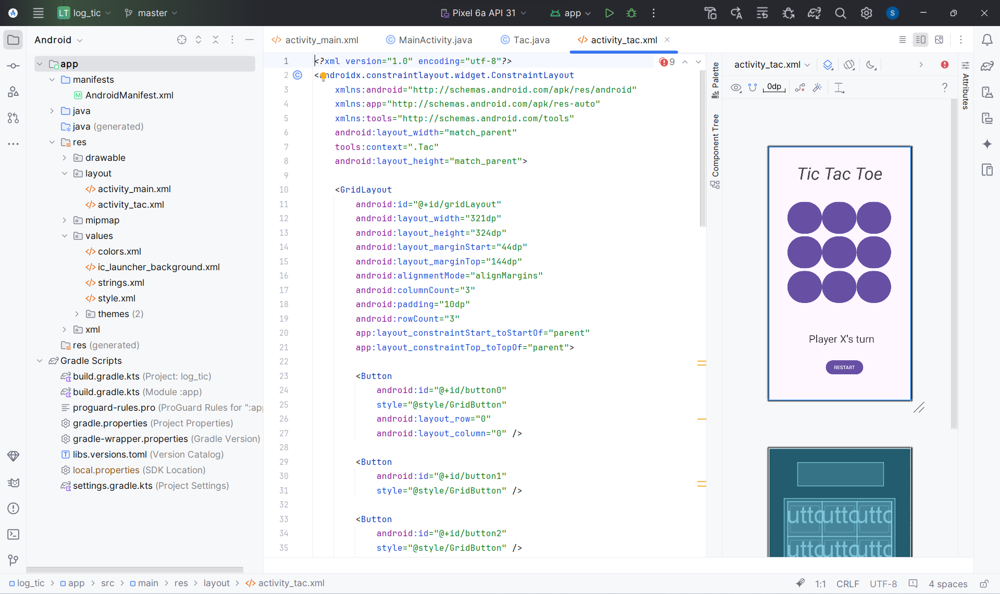
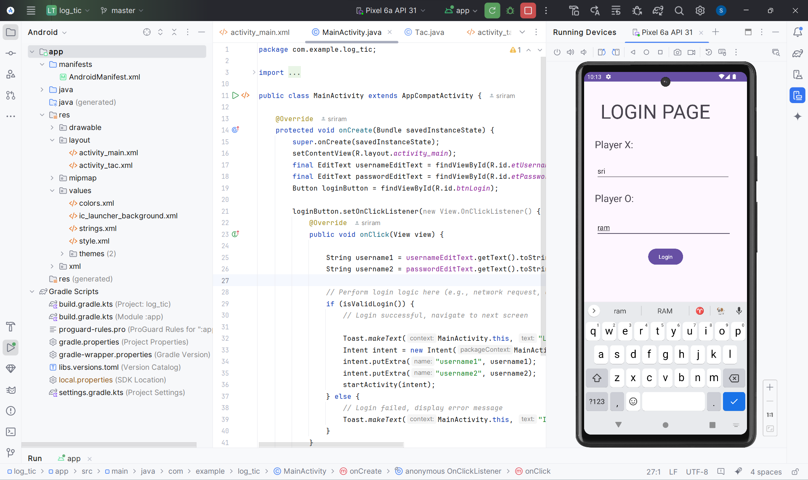
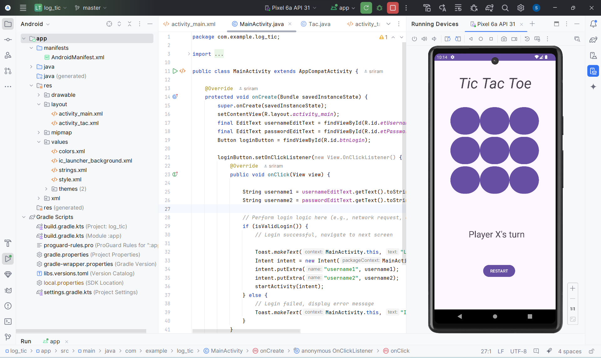
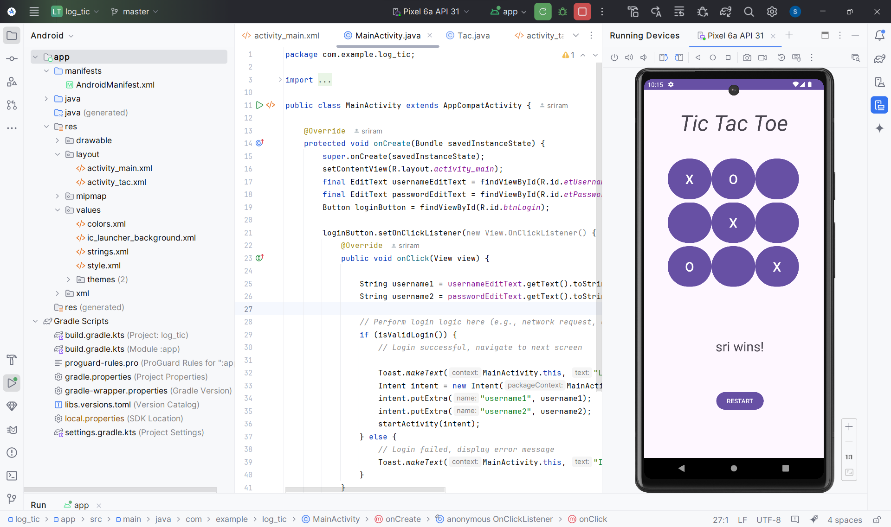

# Tic Tac Toe

This project implements a faithful rendition of the classic Tic Tac Toe game, optimized for the Android platform. It provides a captivating and strategic experience for two players, allowing them to engage in a battle of wits on a meticulously crafted 3x3 grid.

## Features

- Simple and intuitive gameplay
- Track turns for each player (X and O)
- Detect wins and draws
- Reset button to start a new game


## Deployment

To deploy this project run

- Android Studio installed:
```bash
   Download Android Studio
```
- Clone this repository using Git or download the ZIP file:
```bash
  https://github.com/Sri699/Tic_Tac_Toe.git
```
- Open in Android Studio:
```bash
Open the project directory in Android Studio.
```
- Run the App: 
```bash
  Click the "Run" button or use the "Run" menu to launch the app on an emulator or connected device.
```
## How to Play

- The app will display a 3x3 grid.
- Players take turns tapping on empty cells to place their marker (X or O).
- The game automatically detects wins (horizontal, vertical, or diagonal) and draws.
- Use the "Reset Game" button to start a new game.
## Screenshots








